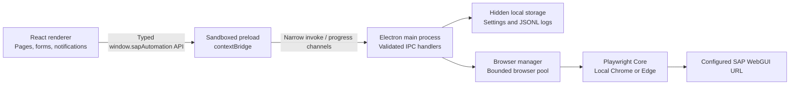

# SAP Automation Toolbox

SAP Automation Toolbox is a local-first Windows desktop application for controlled SAP WebGUI and SAP GUI automation. Version `0.2.3` includes the packaged automation engines, purchasing-oriented UI, locally persisted settings, concurrent operation workflows, and Excel batch processing.

Windows certificate confirmation is intentionally manual. The app shows a prominent reminder and waits for the user to select the certificate and complete SAP sign-in. No SAP credentials or certificate private keys are read or stored.


## Architecture

The application uses Electron's standard three-process separation. The renderer cannot import Electron, access the filesystem, or invoke Playwright directly.



The source is organized by responsibility:

- `src/main` — application lifecycle, IPC handlers, settings service, and browser automation.
- `src/preload` — narrow typed API exposed with `contextBridge`.
- `src/renderer` — React application, pages, components, hooks, and local styles.
- `src/shared` — IPC channel constants and request/response contracts shared across processes.
- `scripts/smoke-test.mjs` — repeatable desktop launch and IPC smoke test.

All runnable tools are presented in **Operations**. Each operation card includes an Info button that opens a bilingual animated step guide. Create RFQ is no longer a standalone sidebar entry; its Operations card opens the preparation workspace.

## Prerequisites

- Windows 10 or Windows 11
- Node.js 20 or newer
- npm
- A locally installed Google Chrome (default) or Microsoft Edge
- Access to your organization's SAP WebGUI network (often through VPN)

Playwright uses the selected browser already installed on Windows. It does not download or use a separate Chromium browser.

## Install and run

```powershell
npm install
npm run dev
```

Useful commands:

```powershell
npm run typecheck
npm run lint
npm run build
npm run smoke
npm run package:win
```

`npm run smoke` builds the production application, opens a real Electron window, exercises every sidebar route, previews the configured ME12 workbook without modifying it, verifies settings IPC, tests the automation IPC path, and writes screenshots under `artifacts/`.

The optional packaging command creates a Windows NSIS installer under `release/`.

## Configure SAP WebGUI

1. Open **Settings** in the application sidebar.
2. Confirm the URL template:
   `https://ui5ce.volvo.com/sap/bc/gui/sap/its/webgui?~transaction={tcode}#`
3. Select Google Chrome or Microsoft Edge.
4. Configure the batch start row, rows per batch, and maximum concurrent browsers.
5. Select English or Simplified Chinese, choose Small, Medium, or Large text, and select Light or Dark theme.
6. Confirm the download folder and select **Save Settings**.
7. Return to **Dashboard** or **Operations** and select **Open SAP WebGUI**. Confirm the Windows certificate in the browser when prompted.

`{tcode}` is replaced in the main process for each function. The generic Open SAP operation uses `SMEN`; validated Create RFQ launches `ME41`.

## Hidden local data and Key User logs

The main process creates `.local-data` beneath Electron's per-user application data directory and applies the Windows Hidden attribute. The parent AppData directory is also hidden by Windows. Data is organized as:

```text
.local-data/
  data/
    settings.json
    execution-history.json
  logs/
    sap-toolbox-YYYY-MM-DD.jsonl
  browser-profiles/
    chrome-automation-profile-1/
    chrome-me12-batch-profile/
  me12-error-screenshots/
```

Settings use an atomic temporary-file rename. Existing `settings.json` files from earlier versions are migrated automatically. Defaults are persisted on first launch, so every later launch reads the same local file.

Diagnostic logs are structured JSON Lines records with timestamp, level, category, event, message, error code, and T-code where relevant. They cover application startup, settings changes, IPC validation, browser progress, certificate waiting, and automation outcomes. ME12 record messages retain the complete Info Record number for Key User troubleshooting; credentials and certificate contents remain excluded.

In **Settings → Diagnostics / 诊断日志**, a Key User can filter recent records by level or search text and open the physical log folder. Logs never contain SAP passwords, certificate contents, or RFQ field values.

## Electron IPC

The preload exposes only these renderer capabilities:

```ts
window.sapAutomation.openSapWebGui({ tcode: 'SMEN' })
window.sapAutomation.onAutomationProgress(listener)
window.sapAutomation.getSettings()
window.sapAutomation.saveSettings(settings)
window.sapAutomation.getDiagnosticLogs(query)
window.sapAutomation.openLogFolder()
window.sapAutomation.downloadMe12Template()
window.sapAutomation.selectMe12ExcelFile()
window.sapAutomation.previewMe12Batch(config)
window.sapAutomation.startMe12Batch(config)
window.sapAutomation.cancelMe12Batch()
window.sapAutomation.onMe12Progress(listener)
```

IPC channel names are centralized in `src/shared/ipc-channels.ts`. Inputs are treated as `unknown` and validated in the main process. Renderer origins are checked before a request is accepted. The complete `ipcRenderer` object is never exposed.

The main window uses:

- `contextIsolation: true`
- `nodeIntegration: false`
- `sandbox: true`
- A dedicated preload bundle
- Denied in-app popup creation
- No renderer filesystem or Playwright access

## Playwright proof of concept

When **Open SAP WebGUI** is selected:

1. React calls the typed preload API.
2. The preload invokes `automation:open-sap`.
3. The main process validates the sender and reads local settings.
4. The browser manager validates the T-code request, resolves `{tcode}`, and enforces the configured concurrency limit.
5. Playwright starts a visible persistent browser context using the `chrome` or `msedge` channel.
6. The selected browser uses its own automation profile beneath the hidden local-data directory, never the user's normal browser profile.
7. The application enters **Waiting for Login** and shows a prominent action-required reminder until the user confirms the Windows certificate and SAP sign-in completes.
8. Login is allowed up to three minutes.
9. Structured success, user-action, or failure information returns to the renderer through reusable notifications.

The browser remains open after successful navigation. A second request brings the existing automation page to the foreground. Closing that browser context allows a later request to launch it again.

The native Windows certificate dialog is not controlled by Playwright. The user selects the certificate and clicks **OK** directly in Chrome or Edge. The application does not read or export certificate contents, private keys, or passwords.

Handled errors include an empty or invalid URL template, an invalid T-code, a missing browser installation, browser launch failure, DNS/VPN/network navigation failure or timeout, rejected IPC, and reaching the configured concurrency limit.

## Create RFQ validation and launch

Create RFQ is opened from **Operations**. Run RFQ remains disabled until all required local fields pass validation. Editing any header, item, or supplier field invalidates the previous result and requires validation again.

After successful validation, **Run RFQ** opens SAP transaction `ME41` through the same typed IPC and certificate-aware browser flow. It does not yet copy form values into SAP or submit an RFQ.

## ME12 Supplier Lead Time batch

Open **Operations → ME12 Supplier Lead Time** and use the three-step flow:

1. Select **Download template**. The file is written directly to the configured download folder; if the name already exists, a numbered copy is created.
2. Fill the `ME12 Upload` sheet and save it. Keep the two headers unchanged.
3. Select **Upload completed template**. The app detects the Info Record and Plant columns and previews the file automatically.

The bundled bilingual template stores Info Record values as text, provides a Plant `C100` drop-down, highlights duplicates, and includes an English/Chinese instruction sheet. Template headers and column positions are detected automatically. The page exposes only Target Plant, Purchasing Organization, and Target Supplier Lead Time; retry, checkpoint, and record-limit values use the internal defaults.
- Target Plant and Purchasing Organization: `C100`
- Target Supplier Lead Time: `1`
- Info Record width: 10 digits
- Two retries and an Excel checkpoint every five records

Preview is read-only. It filters to the target Plant, ignores empty Info Records, deduplicates records for SAP execution, and shows the selected Excel rows. The supplied workbook currently previews 31 selected C100 Info Records.

Before a run, the app creates a timestamped backup beside the workbook. It appends or reuses `ME12 Status`, `Old Supplier Lead Time`, and `ME12 Updated At`; results for a deduplicated Info Record are written to every matching source row. If Excel has the source file locked, the app switches to a timestamped `_ME12_result_...` workbook.

Each record opens `ME12`, clears remembered Supplier/Material values, sets Plant and Purchasing Organization, opens **Purch. Org. Data 1**, verifies the target Plant when readable, changes Supplier Lead Time, validates the field readback, and saves. Current-record lock messages are skipped without retrying; other failures retry and create a screenshot under the hidden local data directory.

ME12 always runs in live mode and requires explicit confirmation after preview. The app creates a timestamped source-workbook backup before making SAP changes.

ME12 starts up to **Maximum Concurrent Browsers** independent worker windows, limited by the number of selected records and any slots already occupied by other SAP automation. Workers use separate persistent profiles and take unique Info Records from one shared queue, so the same Info Record is never assigned twice. Each browser window requires manual certificate confirmation. SAP record-lock responses are still detected and skipped safely.

## Real execution history

**Execution History** reads real records from `.local-data/data/execution-history.json`. Open SAP, Create RFQ launch, and ME12 batch runs record their start time, duration, status, result summary, T-code, ME12 counts, actual worker-browser count, and result/backup paths. Existing terminal diagnostic events are migrated the first time the history store is created.

## Current limitations

- Run RFQ opens `ME41`, but SAP field entry and submission are not implemented.
- Create RFQ Excel upload and template generation are placeholders.
- Dashboard metrics and recent activity are calculated from the real local execution-history store.
- RFQ drafts exist only in React state for the current session.
- Browser choice supports installed Google Chrome and Microsoft Edge; visible mode is required.
- Windows certificate confirmation and SAP form credentials are never automated or stored.
- English and Simplified Chinese UI modes and three persisted text sizes are available; the default is Large.
- The ME12 selectors are resilient label/role fallbacks but still require validation against the production WebGUI theme.
- No RFQ SAP field automation, database, cloud sync, telemetry, or auto-update is present.

## Planned next milestone

The next milestone can add resumable scheduling, approved RFQ Excel templates, and carefully mapped SAP RFQ field automation. Credential handling should remain outside the application.

## Security notes

- Never add SAP usernames or passwords to source code, settings, fixtures, or logs.
- Keep URL and file validation in the main process even when renderer validation is added.
- Add only purpose-specific preload methods; do not expose raw Electron APIs.
- Review and pin selectors against a non-production SAP environment before adding RFQ automation.
- Keep each dedicated automation profile separate from the user's everyday browser profiles.
- Production runtime dependencies currently report `0` known vulnerabilities with `npm audit --omit=dev`.
